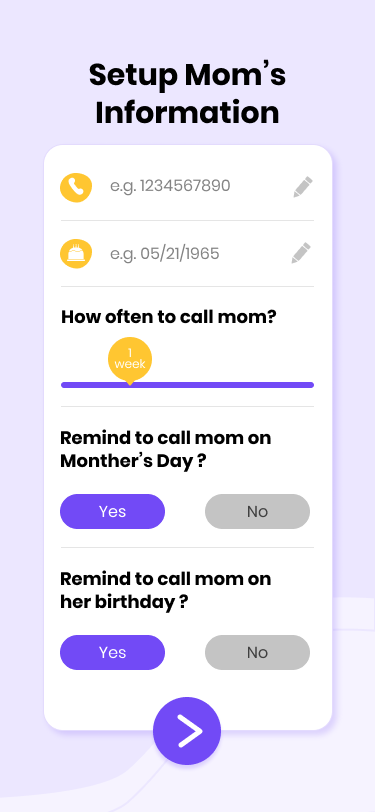
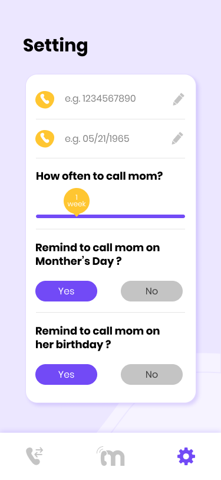
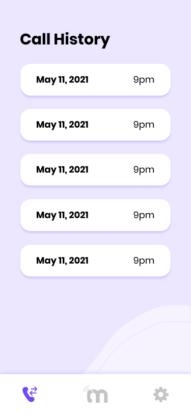

# Call Your Mom

> `An app to nag you, even when she isn't there`


## Getting started

clone the project
```
git clone https://github.com/BrooklinJazz/call-your-mom.git
```

install node modules

```
npm install
```

run the metro bundler

```
expo start
```

run on an ios simulator, android emulator, or physical device.

## Features
- Reminders for when you should call your mom
- Trigger a phone call within the app
- Track call history for you mom
- Remember your mom's birthday
- Remember mother's day
- Remember when you last called your mom
- Pleasant welcoming splash screen
- Receive push notifications when you call your mom
- Call Your Mom logo and color pallette

## Techical Stack
- React Native
- Redux (Redux Toolkit)
- Expo
- Push Notifications
- In App Phone Calls

## Design
- Round 1 of Draft Mocks: https://www.figma.com/file/9rkfEL4BOhNgOPwnzdE5Xu/Call-Your-Mom?node-id=0%3A1
- Round 2 of Mocks: https://www.figma.com/file/9rkfEL4BOhNgOPwnzdE5Xu/Call-Your-Mom?node-id=13%3A0

### Splash Screen


### Onboarding


### Setup


### Home Outstanding


### Home Upcoming


### Update Settings


### Call History
